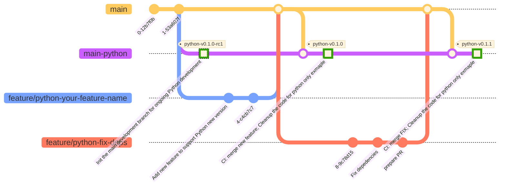

# Contributing to Startups CI/CD Pipeline

First off, thank you for considering contributing to the Startups CI/CD Pipeline. It's people like you that make the open-source community such a great place to learn, inspire, and create. Every contribution is important and appreciated.

1. Fork the Project
2. Create your Feature Branch (`git checkout -b feature/AmazingFeature`)
3. Commit your Changes (`git commit -m 'Add some AmazingFeature'`)
4. Push to the Branch (`git push origin feature/AmazingFeature`)
5. Open a Pull Request

## How Can I Contribute?

There are many ways you can contribute to our project:

- **Reporting Bugs**: This section guides you through submitting a bug report. Before submitting a bug report check the [issues](https://github.com/kksudo/startups-cicd-pipeline/issues) as you might find out that you don't need to create one.
- **Suggesting Enhancements**: This section guides you through submitting an enhancement suggestion, including completely new features and minor improvements to existing functionality.
- **Pull Requests**: This section guides you through the process of submitting a pull request.

### Choosing the Right Branch

To maintain the workflow and stability of the project, we use a specific branch strategy that contributors should follow:

**Git branch strategy**

- The main branch is the starting point.
- main_python represents a branch for Python-specific development that is not stable for production.
feature represents a branch for new feature development.
hotfix represents a branch for bug fixes.
python_v0_1_0 represents a tagged version that is stable and ready for production.



- **`main` Branch**: This is the stable branch of the project. All new features and bug fixes should be based on this branch.

- **Feature Branches**: For new features or non-trivial changes, create a new branch from `main`. Name your branch something descriptive, such as `feature/your-feature-name`. This helps everyone understand what your branch is about.

- **Bugfix Branches**: If you're fixing an urgent bug in the production code, create a branch prefixed with `hotfix/`, e.g., `bugfix/urgent-bug-fix`. Hotfix branches are created from the `main` branch and should be merged back into `main`.

Branches like `python-main`, `nodejs-main`, `java-main`, `golang-main` autogenerated by CI pipeline for python only codebase for clone and ready to quick start purposes. All python production ready tags are created from this branch. Do not create a PR to these branches.

### How to Choose a Branch

1. **For New Features**: Always branch off `main` using the `feature/` prefix.
2. **For Bug Fixes**: If the bug is in production, create a `hotfix/` branch off `main`. If the bug is in an unreleased code, base your work on the appropriate feature or development branch.
3. **For Documentation and Minor Changes**: Directly on the `main` branch is usually okay, but consider the impact of your changes. When in doubt, use a feature branch.

### Before You Start

Before starting your work, check the repository to ensure there isn't already a branch addressing your issue or feature. If a branch exists, consider contributing to that branch instead of starting anew.

Remember, choosing the right branch at the start of your work helps streamline the development process and makes managing contributions easier for everyone.

If you're ever unsure about where to base your work, don't hesitate to open an issue to ask for guidance.


### Reporting Bugs

Bugs are tracked as [GitHub issues](https://github.com/kksudo/startups-cicd-pipeline/issues). Create an issue and provide the following information:

- **Use a clear and descriptive title** for the issue to identify the problem.
- **Describe the exact steps which reproduce the problem** in as many details as possible.
- **Provide specific examples to demonstrate the steps**.

### Suggesting Enhancements

Enhancement suggestions are also tracked as [GitHub issues](https://github.com/kksudo/startups-cicd-pipeline/issues). Fill in the template with all the necessary information:

- **Use a clear and descriptive title** for the issue to identify the suggestion.
- **Provide a step-by-step description of the suggested enhancement** in as many details as possible.
- **Provide specific examples to demonstrate the steps or provide mock-ups or examples if possible**.

### Pull Requests

- **Fill in [the required template](PULL_REQUEST_TEMPLATE.md)**
- **Do not include issue numbers in the PR title**
- **Follow the style guides**
- **After you submit your pull request, verify that all status checks are passing**

## Style Guides

### Git Commit Messages

- Use the present tense ("Add feature" not "Added feature")
- Use the imperative mood ("Deploy using Docker Compose" not "Deploys using Docker Compose")
- Limit the first line to 72 characters or less
- Reference issues and pull requests liberally after the first line

### Issues

#### Use a spoiler to hide long logs or stack traces:

<details>
  <summary>Spoiler warning</summary>

Spoiler text. Note that it's important to have a space after the summary tag. You should be able to write any markdown you want inside the `<details>` tag... just make sure you close `<details>` afterward.

  ```javascript
  console.log("I'm a code block!");
  ```
</details>

##### How to:

````markdown
<details>
  <summary>Spoiler warning</summary>
  
  Spoiler text. Note that it's important to have a space after the summary tag. You should be able to write any markdown you want inside the `<details>` tag... just make sure you close `<details>` afterward.
  
  ```javascript
  console.log("I'm a code block!");
  ```
  
</details>
````  

##### Credits:
[https://github.com/dear-github/dear-github/issues/166](https://github.com/dear-github/dear-github/issues/166)


## Additional Notes

Remember that contributions to this project should be a respectful communication process. We are all working on this project together to make it the best it can be. Let's have a good time doing it.

- **Questions**: Feel free to ask any questions in your issue or pull request.

Thank you for contributing!
